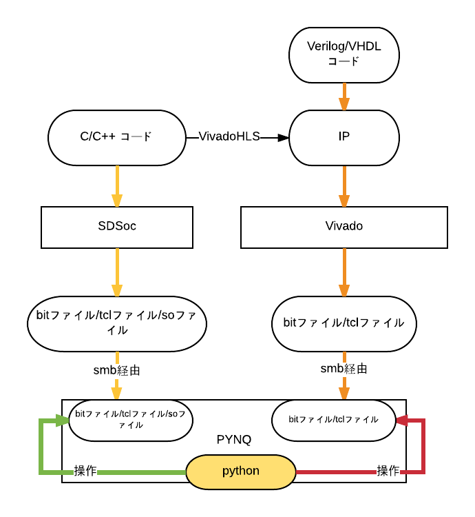

# 調べたPYNQに関する事々 
今回の全体像を図に表すと以下のようになります。

#### PythonでFPGAを操作する仕組み(赤色のライン)
「./LED.ipynb」です。LEDの点灯を題材にどうやってPythonから操作出来るのかを調べています。  

#### 自作bitファイルの読み込み（オレンジのライン）
./led_overlay以下に自分で作成したbitファイルをPythonで動かすという一連の流れを記録したノートブックがあります。  

#### SDSoc（黄色のライン）
./SDSocPFM以下に実際に作成したSDSocプラットフォームがおいてあります。./SDSoc以下にSDSocプラットフォームを作る過程の試行錯誤をおいてあります。

#### これからの課題  
SDSocで生成したsoファイルをpythonで操作する(緑色のライン)というのが未だ出来ていません。今後の課題です。
