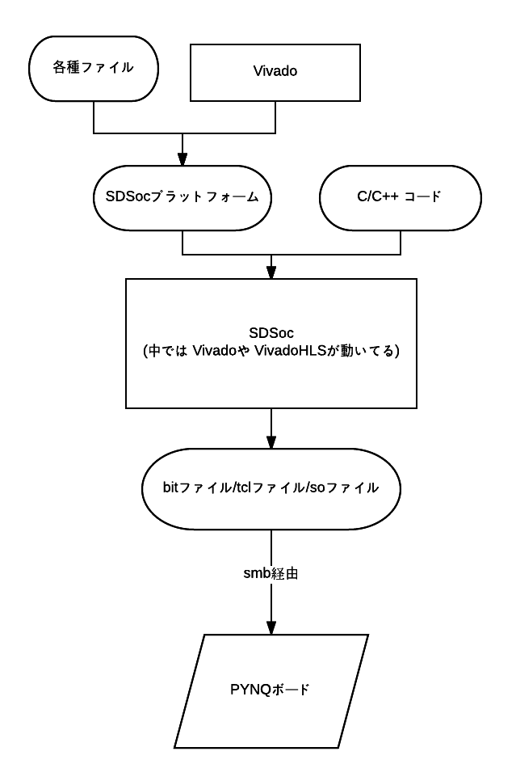
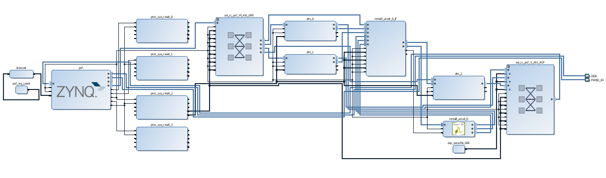

各々のディレクトリはSDSocで作成したso,tcl,bitファイルとそれらをPYNQ上で実行したipynbファイルを持ちます。

../SDSocPFM以下にあるプラットフォームをつくるにあたって、到達目標にしたのが、tkat0さんの
https://github.com/tkat0/pynqmmult/
と同じものを作成するということです。  
pynqmmult-master,　my_pynqmmult_2015_4,　my_pynqmmult_2016_1はその試行錯誤の過程で作成したものです。  

「pynqmmult-master」はtkat0さんの作成したpynqmmultの必要なところのみを取り出し、ディレクトリがシンプルになるように改変したものです。  

「my_pynqmmult_2015_4」と「my_pynqmmult_2016_1」は自分の作ったSDSocプラットフォームで、tkat0さんのpynqmmultと同じCプログラムをSDSocでビルドし、生成ファイルを同じipynb上で実行させたものです。後ろの数字はSDSocのバージョンを表しています。この２つがpynqmmult-masterと同じ挙動を示すか確かめました。

2015_4ではsoファイルが認識されませんでしたが、 2016_1ではtkat0さんのpynqmmultと同じ結果を出しました。このことから、正しくSDSocプラットフォームが作れたことが確認できました。

その上で自分の独自のプログラムで色々試そうとしましたが、CFFIの仕組みがよくわからず、間に合いませんでした。その途中のプログラムが「test_PYNQ_2016_1」です。

SDSocでの開発の流れを図示したものが以下です。
  
そして、my_pynqmmult_2016_1で作成したPL回路は以下になりました。
  
