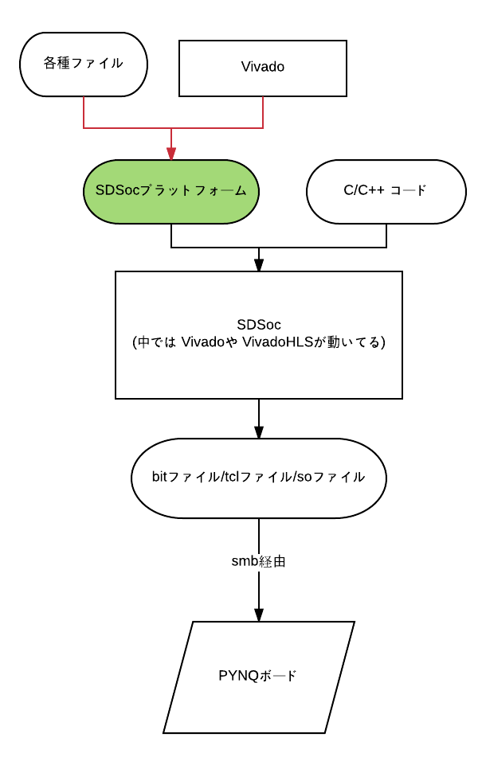

このディレクトリの中にはSDSocプラットフォームが３種類置いてあります。各々の名前は対応するSDSocバージョンを意味しています。例えば、PYNQ_2016_3はSDSoc2016.3専用のSDSocプラットフォームです。なおSDSocプラットフォームはSDSoc環境を利用する上では不可欠なものです。以下の図の緑色の部分に相当します。  
  
PYNQのSDカードに焼いたimgファイルの種類によって、使うべきSDSocのバージョンが異なります。適切なバージョンで作成しないと、生成したsoファイルが認識されません。現時点(2017/03/27)で最新のpynq_z1_image_2017_02_10.imgに対応するSDSocのバージョンは2016.3です。また、pynq_z1_image_2016_09_14.imgに対応するSDSocのバージョンは2016.1です。(2015.4と2016.3では認識されませんでした) 
SDSocのプラットフォームを作るときは、対象のSDSocと同じバージョンのVivadoを用いることを推奨します。原因不明のエラーの原因になります。
