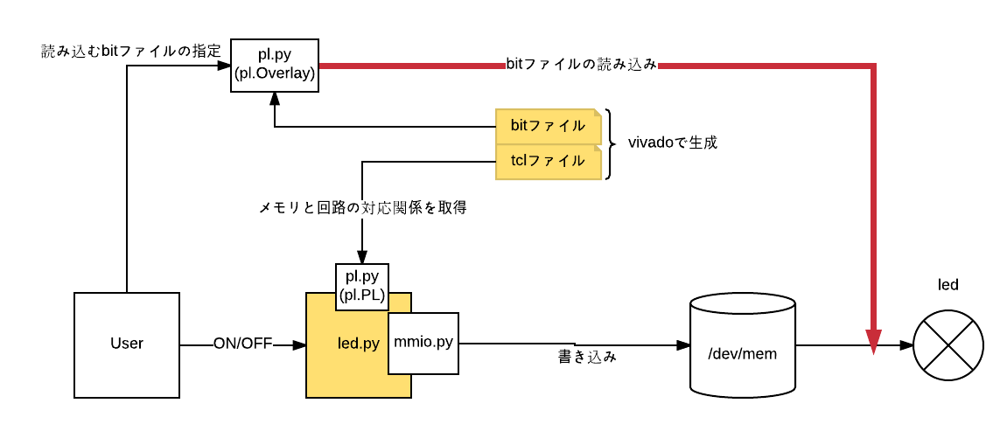

このディレクトリでは実際にbitファイルを作成し、Pythonで動かしてみるという一連の流れを記録しています。
led_overlay.bitとled_overlay.tclは以下のような流れで生成されました。  
 
 
 この２つのファイルを用いて、LEDの点灯をしたのが「./自作bitファイルの読み込み.ipynb」です。
 また、以下の図の赤線のところについてを調べたのが「./PL.Overlayについて.ipynb」です。
  
 
 ### 参考  
 PYNQ-Z1のOverlay読み込みとPythonからのFPGA PLの制御  
 http://todotani.cocolog-nifty.com/blog/2017/01/pynq-z1overlayp.html  
 Adam Taylor's MicroZed Chronicles Part 155: Introducing the PYNQ (Python + Zynq) Dev Board  
 https://forums.xilinx.com/t5/Xcell-Daily-Blog/Adam-Taylor-s-MicroZed-Chronicles-Part-155-Introducing-the-PYNQ/ba-p/731507  
 Adam Taylor’s MicroZed Chronicles Part 156: Pynq Hardware Overlays  
 https://forums.xilinx.com/t5/Xcell-Daily-Blog/Adam-Taylor-s-MicroZed-Chronicles-Part-156-Pynq-Hardware/ba-p/732835  
 Adam Taylor’s MicroZed Chronicles, Part 157: Exploring PYNQ’s Base PL  
 https://forums.xilinx.com/t5/Xcell-Daily-Blog/Adam-Taylor-s-MicroZed-Chronicles-Part-157-Exploring-PYNQ-s-Base/ba-p/734085  
 158  
 https://forums.xilinx.com/t5/Xcell-Daily-Blog/Adam-Taylor-s-MicroZed-Chronicles-Part-158-Creating-our-own-PYNQ/ba-p/735388
